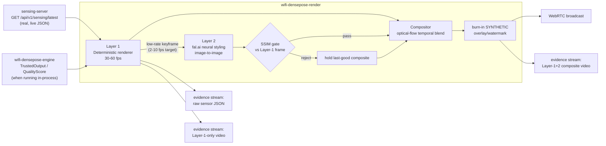

# ADR-352: Real-time dual-renderer neural styling layer

- **Status**: Proposed
- **Date**: 2026-09-01
- **Deciders**: ruv
- **Tags**: rendering, visualization, fal-ai, neural-styling, webrtc, honesty-discipline, phase-4

## Context

RuView's perception substrate (ADR-135..146 streaming engine, ADR-300..321
primitives) produces trust-traceable semantic state — presence, pose, vitals,
provenance — but has no real-time *visualization* layer. The closest existing
artifact is the discrete, per-clip fal.ai video generation work in
`wifi-densepose-room-viz` (a different crate, different worktree, out of scope
here): it renders short discrete clips well after the fact, not a live view of
a room.

There is a real product opportunity in a **live** view: something a person can
glance at and see "what the sensors currently believe is happening in this
room," refreshed continuously, not baked from a batch job. Two failure modes
must both be avoided:

1. **Pure deterministic rendering** (skeleton stick-figures, heatmaps) is
   honest but reads as a debug tool, not a product.
2. **Pure neural generation** (feed a diffusion model a text description of
   the scene every frame) is visually compelling but **independently
   hallucinates** — nothing ties the pixels to what the sensors actually
   measured, and the system would be lying about what it "sees."

The user-approved resolution: fal.ai is a **neural styling layer**, not the
authoritative renderer. A deterministic local renderer is sourced directly
from real sensor-derived state and *is* the ground truth; fal.ai only
re-styles that deterministic frame (image-to-image, low strength) at a low
refresh rate, and every neurally-styled frame is validated against the
deterministic frame it was derived from before it is allowed on screen.

## Decision

Build a two-layer real-time rendering pipeline as a new crate,
`v2/crates/wifi-densepose-render`, layered strictly on top of the existing
perception substrate — it consumes real types from `wifi-densepose-engine`
(`TrustedOutput`, `QualityScore`) and the live `wifi-densepose-sensing-server`
`GET /api/v1/sensing/latest` JSON contract (`pose_keypoints`, `vital_signs`,
`classification`, per-node `NodeInfo`), never fabricates a frame, and never
sources from `ruview-twin` for "sensor truth" — `ruview-twin` is an explicit
**SYNTHETIC/L0** propagation *model* (ADR-315), and using its output as if it
were live sensor state would violate the MEASURED/CLAIMED/SYNTHETIC discipline
this repo requires. `ruview-twin` may still be consulted later for
place-holder geometry (wall positions) in deployments that have run twin
calibration, always labelled as such.

### Layer 1 — local deterministic renderer ("sensor truth")

- Consumes real `SensingUpdate` frames (pose keypoints, vitals, per-node
  classification) polled from the live sensing-server, plus room/sensor
  layout.
- Renders deterministically: no model inference, no randomness beyond what
  the upstream data already carries. Same input frame -> same pixels.
- Initial implementation target: a CPU software rasterizer (`tiny-skia` /
  `image`), not GPU `wgpu`, for the first real milestone — this repo's CI and
  the `ruvultra` box are headless Linux with no configured Vulkan/EGL
  swapchain, and standing up headless GPU rendering is its own scoped
  subproject. `wgpu` (headless, offscreen-texture mode) is the stated
  follow-up once a software-rendered Layer 1 is proven against live data;
  this ADR records that scope decision rather than silently shipping less
  than what was asked for.
- Runs at 30-60 fps target against locally available data (no network call in
  the render hot path).

### Layer 2 — fal.ai neural styling keyframes

- Low-frequency (2-10 fps target for production; scaled down further for the
  prototype validation run, see Budget) calls to `fal-ai/fast-lcm-diffusion/
  image-to-image` (LCM, `image-to-image`, WebSocket real-time mode available
  via `fal.realtime.connect`) — confirmed to still exist as of 2026-09-01
  (`https://fal.ai/models/fal-ai/fast-lcm-diffusion/image-to-image/api`).
  Input is the Layer-1-rendered frame (`image_url` as a data URI), `strength`
  kept low (photoreal restyle, not independent generation), output is a
  candidate keyframe.
- fal.ai's public pricing page does not list a flat per-image rate for this
  model (billed by GPU-second, architecture-dependent); the real per-call cost
  used for the budget guard is measured directly from a real minimal API call
  rather than trusted from a scraped price page — see Budget section for the
  measured number.

### Compositor

- Optical-flow-based temporal blending: the last-accepted Layer-2 keyframe is
  warped forward each Layer-1 tick using motion estimated between successive
  Layer-1 frames, so the visible motion stays smooth between low-frequency
  neural updates instead of jumping/holding.

### SSIM-based frame rejection

- Each new Layer-2 keyframe is compared (SSIM or equivalent structural
  similarity) against the Layer-1 frame it was derived from. Below threshold
  (hallucinated content, broken continuity, wrong person count) => reject,
  hold the last good composite, log the rejection.

### Broadcast + evidence recording

- WebRTC output of the composited stream.
- Every test/validation run persists three real, separate artifacts:
  (a) raw sensor evidence (the real underlying `SensingUpdate` JSON stream),
  (b) Layer-1-only deterministic visualization,
  (c) the AI-enhanced Layer-1+2 composite.
- The composite stream carries a burned-in "SYNTHETIC / AI-enhanced" overlay
  at all times it contains Layer-2 content — never presented as raw sensor
  truth, per this repo's non-negotiable honesty rules.

## Budget

Hard cap: **$15 total** fal.ai spend for this task, independent of and
additional to the room-viz agent's own $10-20 cap (different crate, different
worktree, different budget). Real spend is tracked and reported at each phase
boundary; see the crate's own budget-tracking module for the running total.

## Consequences

- New crate `wifi-densepose-render` depends on the engine/twin/witness crates
  for types, and on the sensing-server's HTTP JSON contract for live data —
  it does not reimplement scene-state extraction.
- First real milestone renders live local frames only (Layer 1); Layer 2
  neural styling, compositor, WebRTC broadcast, and the three-stream
  recording land in subsequent phases of this ADR's implementation, each
  committed independently so partial progress is never lost.
- A CPU rasterizer, not `wgpu`, is the real Layer-1 renderer for this first
  milestone; upgrading to `wgpu` offscreen rendering is tracked as follow-up
  work under this same ADR, not silently substituted without recording it
  here.

## References

- `docs/adr/ADR-136-*` .. `ADR-146-*` — streaming engine primitives consumed
  by this layer.
- `docs/adr/ADR-315-digital-rf-twin...md` — why `ruview-twin` output is
  SYNTHETIC/L0 and must not be used as sensor truth.
- `v2/crates/wifi-densepose-sensing-server/src/main.rs` — live
  `GET /api/v1/sensing/latest` JSON contract this layer consumes.
- `https://fal.ai/models/fal-ai/fast-lcm-diffusion/image-to-image/api` — the
  fal.ai endpoint used for Layer 2.
